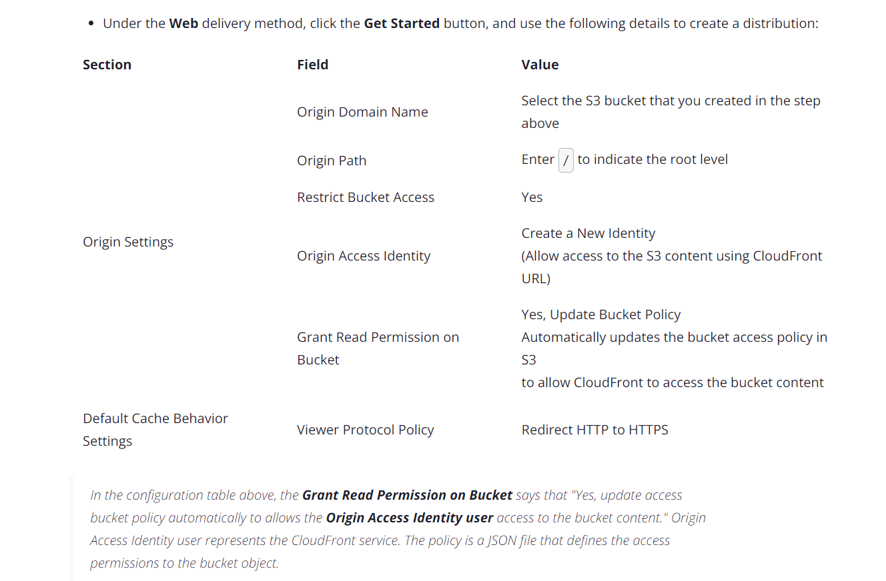

### General Notes

> Content Delivery Network that speeds up delivery through _edge locations_

> Works with [[Simple Storage Service (S3)]], [[Elastic Cloud Compute (EC2)]], [[Lambda]], [[Elastic Load Balancer]], and AWS Shield

> Continuously adds new _edge locations_

> Max size of single file is 20 GB

___

### How does it work

Data is cached at edge locations. When user requests data, edge locations are first checked. If data not present, then data is pulled from origin and cached there.

___

### Properties

> Origins: Choose the origin file, probably a [[Simple Storage Service (S3)]] bucket
> Restrictions: block IPs from certain countries (GeoIP)
> Invalidations: Expire content from cache

___

### Cloudfront Distribution on [[Simple Storage Service (S3)]] Bucket

> Static website

1. Create the bucket
2. Add files to bucket
3. 

3. [[Simple Storage Service (S3)]] bucket access policy will change 
4. Take domain name of the cloudfront distribution and add `/filename` and paste url in browser

___

### Deletion

* Disable and delete the cloudfront distribution
* delete origin access policy from origin access identity service