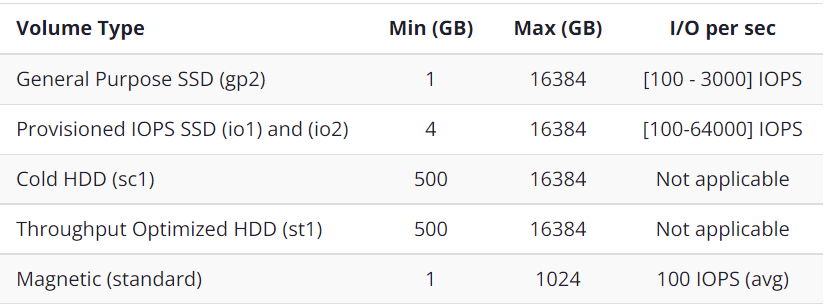

### General Notes

Ideal for applications that have intensive data transactions.
- Faster than [[Simple Storage Service (S3)]], but requires manual configuration.

It is a storage solution for [[Elastic Cloud Compute (EC2)]] instances.
- Physical hard drive attached to increase storage 

____
### Volume Types

---
